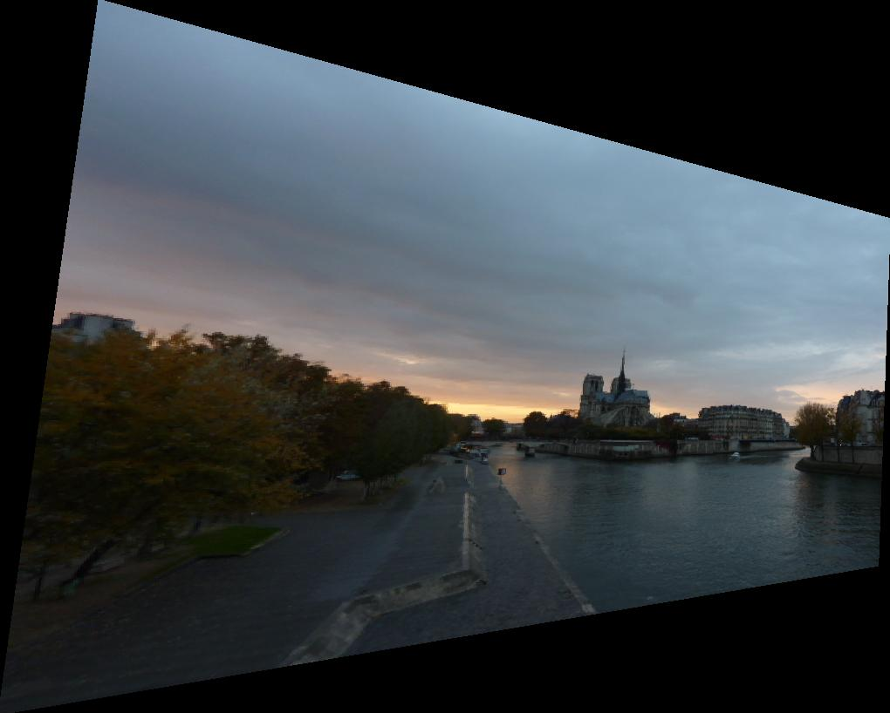
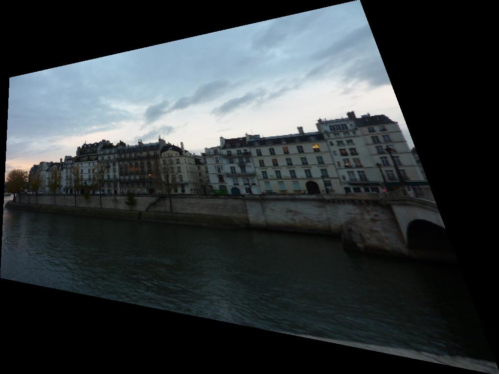
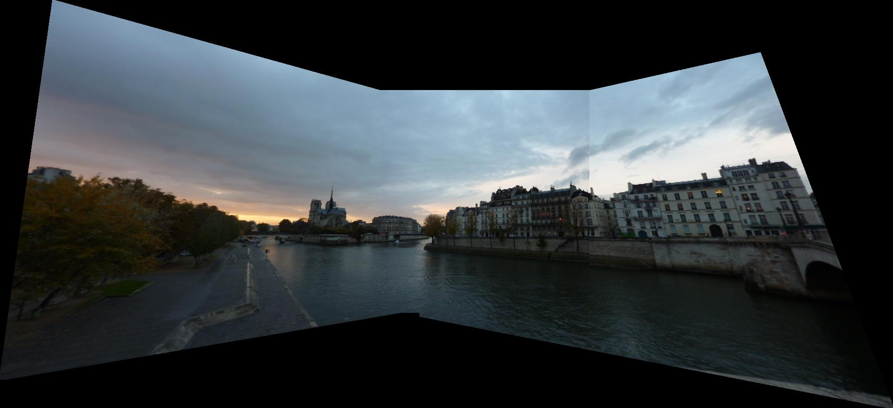

A Python program which can stitch two/three input images together to create a single panoramic image. There are four main modules which are point selection, homography calculation, image warping and blending method.

## 1. Point selection
For this part, given two images, we need to select some x and y-axis values from images by clicking on the images (or given some predetermined coordinates). We use ginput function, which allows us to select points by clicking on the images. Note that stitching problems are caused mainly by the point selection part (how many points to select, where, how the points should be spread over the image, the order of the points, etc.)

## 2. Homography estimation
A homography matrix (H) is created to map between two images. More clearly, we need to homography matrix to map points from one projected plane in an image to points in a projected plane from another image. Therefore, these two images will be in the same plane. In this work, the single value decomposition (svd) method is used to obtain the homography matrix. One image selected as base/destination (e.g., paris_b) image and another (e.g., paris_a) as source image.

## 3. Image warping
We create a method that takes an image and a homography (H) matrix as input and generate a warped image as output. Suppose that we create an H matrix to take the target image into the plane of the base image. We use the homography matrix for each input image pixel to warp it to a new projected plane. This is the main idea of warping. There are two commonly used techniques for this: forward and backward warping. In this work, backward warping is used.

## 4. Blending images
To investigate this part, we create a new method named blend3images, which takes two warped images, one base image, two offset_x, and two offset_y values and returns the stitched image as output.

## Run the image stitching code

Please, organize files in the following way:
```
./
├── images/
│   ├── paris_a.jpg
│   ├── paris_b.jpg
│   └── paris_c.jpg
├── points/
│   ├── points_paris_a_-paris_ab.npy
│   ├── points_paris_b_-paris_ab.npy
│   ├── points_paris_b_-paris_bc.npy
│   └── points_paris_c_-paris_bc.npy
└── image_stitching.py
```
       
Run image_stitching.py in a Python IDE or the terminal by typing:
```python image_stitching.py```


## An example of output

#### image_stitching.py:
```
Homography matrix is calculated.
Homography:
 [[ 1.96691871e+00 -1.17559787e-01 -5.59240978e+02]
 [ 4.81475201e-01  1.59446665e+00 -1.93612606e+02]
 [ 1.59303521e-03 -1.79643320e-04  1.00000000e+00]]
Warping is started.
x_values:  [array([-559.24097798]), array([345.70740217]), array([331.9575678]), array([-673.5068041])]
 y_values:  [array([-193.61260557]), array([56.51779109]), array([623.81573257]), array([454.37104122])]
offset_x:  -674          size_y:  -674
size_x:  1020    size_y:  818
Homography inverse:
 [[ 3.36901347e-01  4.70944166e-02  1.97527111e+02]
 [-1.70624596e-01  6.17303831e-01  2.40975370e+01]
 [-5.67347276e-04  3.58714457e-05  6.89661318e-01]]
Warping is completed.
Homography matrix is calculated.
Homography:
 [[ 4.87205344e-01 -1.25500862e-01  2.46575390e+02]
 [-1.95562408e-01  6.69094574e-01  7.80722382e+01]
 [-6.55667769e-04 -3.78970038e-04  1.00000000e+00]]
Warping is started.
x_values:  [array([246.5753903]), array([960.19352207]), array([1246.01411897]), array([227.81496457])]
 y_values:  [array([78.07223818]), array([-80.70543317]), array([486.96581047]), array([684.86366115])]
offset_x:  227   size_y:  227
size_x:  1020    size_y:  766
Homography inverse:
 [[ 1.55701902e+00  7.14375125e-02 -3.89499859e+02]
 [ 3.21736591e-01  1.44602867e+00 -1.92227021e+02]
 [ 1.14281572e-03  5.94840816e-04  6.71769215e-01]]
Warping is completed.
Blending three images is started.
Column number of left:  1020     Row number of base:  818
Column number of middle:  640    Row number of middle:  480
Column number of right:  1020    Row number of right:  766
size_x:  1921    size_y:  879
Blending is completed.
Blended image is generated.
```

Created warped paris_a image
<p align="center"></p>

Created warped paris_c image
<p align="center"></p>

Created blended image
<p align="center"></p>

##### This project was implemented for CmpE 537 Computer Vision Course of Bogazici University.
